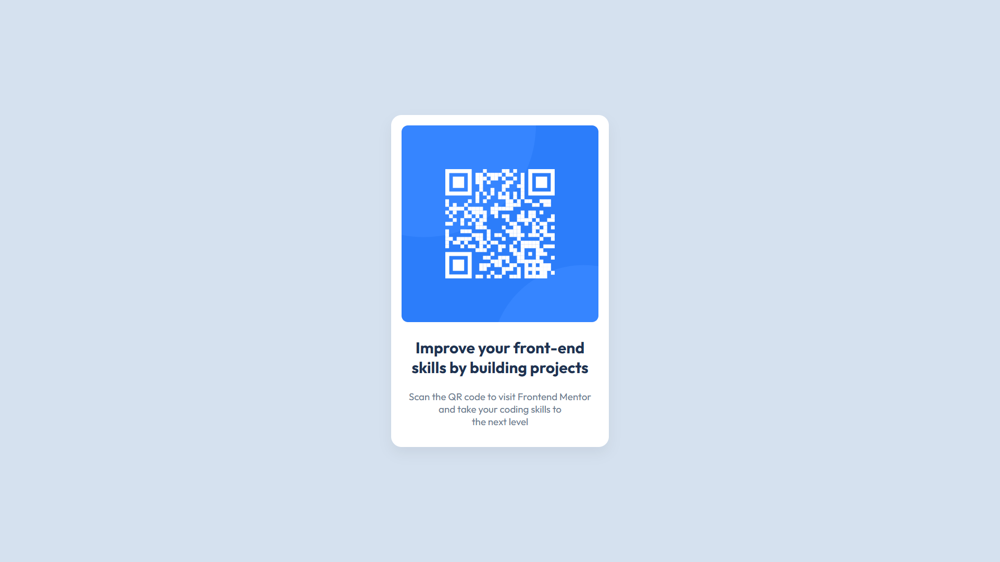

# Frontend Mentor - QR code component solution

This is a solution to the [QR code component challenge on Frontend Mentor](https://www.frontendmentor.io/challenges/qr-code-component-iux_sIO_H). Frontend Mentor challenges help you improve your coding skills by building realistic projects. 

## Table of contents

- [Frontend Mentor - QR code component solution](#frontend-mentor---qr-code-component-solution)
  - [Table of contents](#table-of-contents)
  - [Overview](#overview)
    - [Screenshot](#screenshot)
    - [Links](#links)
  - [My process](#my-process)
    - [Built with](#built-with)
    - [What I learned](#what-i-learned)
  - [Author](#author)

## Overview

### Screenshot

### Links

- Live Site URL: https://adityakrishnamurthy.github.io/QR-Code-Component/

## My process

Rather than complicate this with using a framework, I felt using HTML and CSS on their own would be sufficient.

### Built with

- Semantic HTML5 markup
- CSS custom properties

### What I learned

CSS Positioning and Custom Font Styles with Google Fonts

## Author

- GitHub - [Aditya K](https://github.com/AdityaKrishnamurthy)
- Frontend Mentor - [@CrescendoFluffy](https://www.frontendmentor.io/profile/CrescendoFluffy)

